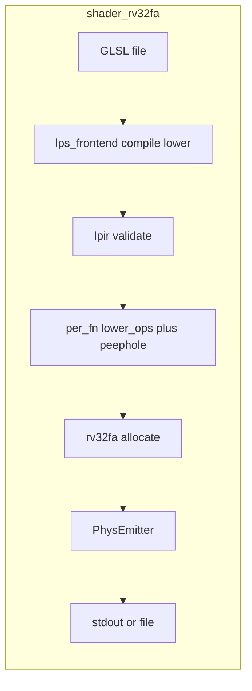

# Design

## Scope

Add a dedicated **`shader-rv32fa`** CLI subcommand (new surface area) for the fastalloc / PInst pipeline: GLSL → LPIR → lower → `rv32fa::alloc::allocate` → `PhysEmitter`, with **debug output for stages that exist today turned on by default**, and **opt-out flags** (`--no-*`) to disable each stream. Do **not** implement `--trace` or `--show-cfg` in this milestone; add **opt-out or opt-in** for those to **`shader-rv32fa` only when** allocator trace and CFG/liveness exist (follow the same “verbose by default” rule if it still fits).

Record cleanup intent: remove legacy **`shader-rv32`** (and its `--pipeline fast` path) in a later milestone; document on the fastalloc v2 cleanup roadmap.

## File structure

```
lp-cli/src/
├── main.rs                          # UPDATE: Cli::ShaderRv32fa + match arm
├── commands/
│   ├── mod.rs                       # UPDATE: pub mod shader_rv32fa
│   └── shader_rv32fa/
│       ├── mod.rs                   # NEW: pub use args/handler
│       ├── args.rs                  # NEW: clap Args for shader-rv32fa
│       └── handler.rs               # NEW: handle_shader_rv32fa (shared core w/ optional extract)

docs/roadmaps/2026-04-10-fastalloc-v2/
└── m9-cleanup.md                    # UPDATE: bullet — remove shader-rv32 when rv32fa CLI is canonical
```

Optional follow-up (not required for M2 closure): shorten [docs/roadmaps/2026-04-10-fastalloc-v2/m2-cli-debug.md](docs/roadmaps/2026-04-10-fastalloc-v2/m2-cli-debug.md) with a pointer to this plan if the roadmap and plan diverge.

## Conceptual architecture



Shared logic with today’s `shader-rv32 --pipeline fast` should live in **one place** (extracted helper in `lp-cli` or thin `shader_rv32` calling into `shader_rv32fa` internals) to avoid two diverging pipelines.

## Main components

- **`args.rs`**: `clap::Parser` struct: `input`, `-o/--output`, `--float-mode` (q32|f32), `--format` (`text` | `bin` | `hex`). **Default-on debug** (each independently suppressible):
  - **`--no-lpir`**: when absent, print LPIR once per run (stderr recommended).
  - **`--no-vinst`**: when absent, print VInst listing per function (stderr).
  - **`--no-pinst`**: when absent, print PInst / assembly text listing per function (stderr).
  - **`--no-disasm`**: when absent, print word disassembly (`lp_riscv_inst`) per function (stderr).
  - Optional **`--quiet`**: if present, treat as all `--no-*` above (still allow overriding later if we add fine-grained “quiet except X”; for M2, simplest is `--quiet` == hide all four).
  - **No** `--trace`, **no** `--show-cfg` until implemented.
- **Streams**: Keep **artifact output** (final `text` / `bin` / `hex` product) on **stdout** or `-o` so pipes stay usable; keep **default verbose listings** on **stderr** (matches common “errors and debug on stderr” convention).
- **`handler.rs`**: Same pipeline as today’s fast path; gate each stderr block on `!args.no_*` (and `!args.quiet` where applicable). LPIR: `lpir::print::print_module`; VInst: mnemonic + `format_alloc_trace_detail`; PInst: `rv32fa::debug::PInst` formatters; disasm: `lp_riscv_inst::format_instruction`.
- **`--format` default**: **`text`** — human-oriented listing (PInst text blocks per function, optionally `.globl` lines) to stdout when no `-o`; **`bin`** / **`hex`** as today.

### Clap implementation note

Prefer boolean **opt-out** fields defaulting to `false` with `#[arg(long, action = clap::ArgAction::SetTrue)]` on `--no-lpir`, etc. (presence of flag disables that section). Document in `--help` that default behavior is verbose on stderr.

## Notes (decisions from iteration)

- **Command shape**: Dedicated **`shader-rv32fa`**; treat as the new command; legacy **`shader-rv32` removal** deferred — note on [m9-cleanup.md](docs/roadmaps/2026-04-10-fastalloc-v2/m9-cleanup.md).
- **Trace / CFG**: **Not** in M2; add flags to **`shader-rv32fa`** incrementally when features exist (prefer same **opt-out** style: e.g. `--no-trace` once trace is default-on, unless trace stays rare).
- **Verbose by default**: Per-stage listings **on** unless the matching **`--no-*`** or **`--quiet`** is passed; artifact `--format` unchanged.
- **Questions in chat** for any further scope tweaks (no form widget required).
- **Filetests**: Native filetests use `NativeEmuEngine` and `LPVM_ALLOC_TRACE`, not `lp-cli`; M2 does **not** require runner changes unless explicitly expanded later. Optional doc line in `lps-filetests` README pointing to `shader-rv32fa` for manual repro is enough.

# Phases

## Phase 1: `shader_rv32fa` module and `main` wire-up

### Scope

New module directory, `commands/mod.rs` export, `Cli` variant and match arm delegating to handler.

### Code organization

- Entry (`handler::handle_shader_rv32fa`) first; helpers at bottom of `handler.rs`.

### Implementation

- Add `lp-cli/src/commands/shader_rv32fa/{mod.rs,args.rs,handler.rs}`.
- `args.rs`: derive `Parser`; document subcommand in `about`.
- `main.rs`: `ShaderRv32fa { #[command(flatten)] args: shader_rv32fa::Args }` or explicit fields—prefer **flatten** if struct is standalone for reuse.

### Tests

- None required beyond `cargo run -p lp-cli -- shader-rv32fa --help` in Validate.

### Validate

```bash
cargo check -p lp-cli
cargo run -p lp-cli -- shader-rv32fa --help
```

## Phase 2: Pipeline implementation and de-duplication

### Scope

Implement handler end-to-end; **extract** shared “fast pipeline per module” logic from [lp-cli/src/commands/shader_rv32/handler.rs](lp-cli/src/commands/shader_rv32/handler.rs) into a function both `shader-rv32 --pipeline fast` (until removed) and `shader-rv32fa` call, **or** have `shader_rv32` delegate to `shader_rv32fa` when `pipeline == fast` to guarantee one codepath.

### Implementation details

- Inputs: `&IrModule`, `&LpsModuleSig`, `FloatMode`, **verbosity / opt-out** struct (`no_lpir`, `no_vinst`, `no_pinst`, `no_disasm`, `quiet`), output `&Path` or stdout, `OutputFormat`.
- Errors: `anyhow` context strings consistent with `shader-rv32`.
- Preserve current semantics: one **string** output for `text` mode concatenating per-function sections; `bin` may write **concatenated** function bodies (document if no ELF relocation merge—acceptable for M2 debug tool).

### Tests

- Optional: `lp-cli` integration test invoking `shader-rv32fa` on [lp-shader/lps-filetests/filetests/debug/native-rv32-iadd.glsl](lp-shader/lps-filetests/filetests/debug/native-rv32-iadd.glsl) and asserting substring `FrameSetup` or `add` in stdout (lightweight).

### Validate

```bash
# Default: stderr gets LPIR + VInst + PInst + disasm; stdout gets text artifact
cargo run -p lp-cli -- shader-rv32fa lp-shader/lps-filetests/filetests/debug/native-rv32-iadd.glsl

cargo run -p lp-cli -- shader-rv32fa ... --format hex
cargo run -p lp-cli -- shader-rv32fa ... --quiet
cargo run -p lp-cli -- shader-rv32fa ... --no-disasm
```

## Phase 3: Flags polish and defaults

### Scope

Confirm **`--help`** text states default-on stderr verbosity and lists every `--no-*` and `--quiet`. Ensure LPIR print uses `lpir::print::print_module` once per module (unless per-function is clearly better—document in help). User-visible names: prefer **`--no-pinst`** alongside help string “physical instruction listing (PInst)” if the type name is unfamiliar.

### Validate

```bash
cargo +nightly fmt -p lp-cli
cargo check -p lp-cli
```

## Phase 4: Roadmap cleanup note

### Scope

Append to [docs/roadmaps/2026-04-10-fastalloc-v2/m9-cleanup.md](docs/roadmaps/2026-04-10-fastalloc-v2/m9-cleanup.md):

- Remove **`shader-rv32`** / unified linear CLI once **`shader-rv32fa`** + any remaining linear-only tooling is migrated.

### Validate

Doc-only; no build.

## Phase 5: Cleanup and validation

### Scope

Grep for `TODO`/`dbg!` in new files; remove stray dead code.

### Validate

```bash
cargo +nightly fmt -p lp-cli
cargo check -p lp-cli
cargo check -p fw-esp32 --target riscv32imac-unknown-none-elf --profile release-esp32 --features esp32c6,server
```

Per workspace rules if touching `lp-core/` / `lp-shader/` / `lp-fw/` — this plan only touches `lp-cli` and `docs/` for m9 note; fw check is quick safety if `lp-cli` pulls same workspace graph.

### Plan file

When phases are done: move this file to `docs/plans-done/` and commit with Conventional Commits (`feat(lp-cli): add shader-rv32fa command`).
